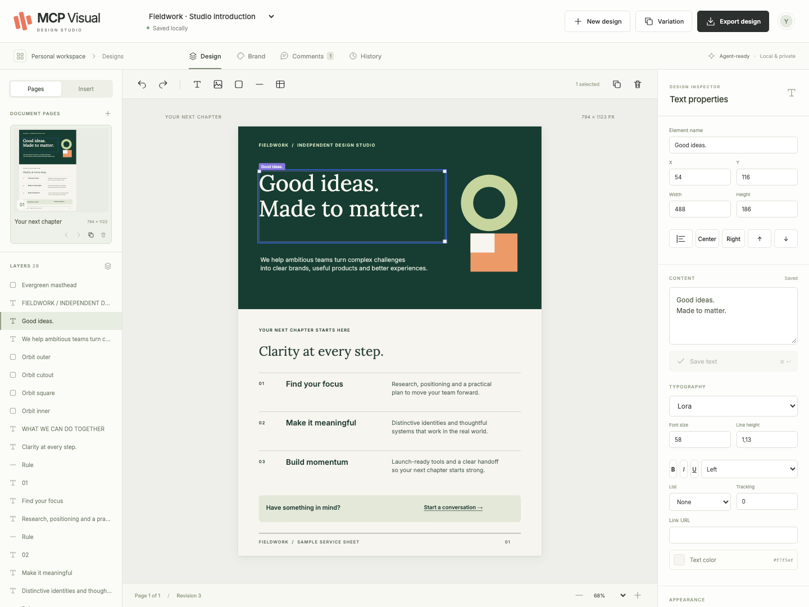

# MCP Visual Design Studio

**A local design workspace for you and your agent.** Make one-pagers, sales sheets, brochures and visual reports together. Your agent supplies the model and conversation; Studio supplies a persistent, editable document and a localhost browser editor.



[Watch the short editing demo](docs/demo.webm) · [Release](https://github.com/borystam/mcp-visual-design-studio/releases/tag/v0.1.0) · [Compatibility and test evidence](docs/VALIDATION.md)

## Install the release

Use **Node.js 24 LTS** (Node 22.12+ also supported). Download and install the release tarball; this version is **not published to the npm registry**.

```sh
npm install -g https://github.com/borystam/mcp-visual-design-studio/releases/download/v0.1.0/mcp-visual-design-studio-0.1.0.tgz
mcp-visual-design-studio doctor
mcp-visual-design-studio editor
```

For PDF and PNG exports, provision Chromium once, separately from your MCP connection:

```sh
mcp-visual-design-studio setup-export
# Linux machines missing browser libraries:
mcp-visual-design-studio setup-export --with-deps
```

Ordinary editing, standalone HTML and editable bundle exports work without Chromium. No browser is downloaded during the MCP handshake. No model API key is required.

## Connect an agent

After the installation above, add this to a host that supports local stdio MCP:

```json
{
  "mcpServers": {
    "visual-design-studio": {
      "command": "mcp-visual-design-studio",
      "args": ["mcp"]
    }
  }
}
```

For Codex, add to `~/.codex/config.toml`:

```toml
[mcp_servers.visual_design_studio]
command = "mcp-visual-design-studio"
args = ["mcp"]
startup_timeout_sec = 30
tool_timeout_sec = 120
```

For a chosen workspace, append `"--workspace", "/absolute/path/to/designs"` to `args` (on Windows, use a JSON-escaped absolute Windows path). Graphical hosts may need the full executable path from `command -v mcp-visual-design-studio` or `where mcp-visual-design-studio`. See [host setup](docs/HOSTS.md).

Try this in your connected agent:

> Open Visual Design Studio. Create a three-page brochure using the Gather template. Make the brand deep blue and warm cream. Inspect the saved document before editing; render each page, check the image and overflow diagnostics, and give me the localhost editor link. Wait for my edits before exporting.

Open the returned private localhost link. Change the text in the inspector and save it; upload an image; drag or nudge an element; leave an anchored comment. Ask your agent to read the selection and comments, make a targeted edit and render it. Changes appear live, without reloading.

Browser comments **do not wake an idle agent**. Ask the connected host to read them. Studio contains no integrated chat, model routing or cloud service.

## What is included

- Blank canvas plus **Fieldwork** service sheet, **Gather** three-page brochure, and **Signal** two-page visual report. All examples are original and generic.
- Multiple pages, custom dimensions, orientation and ordering; text, rich text runs, lists, explicit links, images, crop/fit, shapes, rules, tables and groups.
- Positioned elements and stack/grid groups; selection, drag, resize, keyboard nudge, align, duplicate, delete and layer ordering.
- Reusable local brand kits: colors, bundled fonts, logos and structured components.
- Element comments, selection context, live browser/agent synchronization, retained text drafts and explicit conflict resolution.
- Durable revision history, guarded operation undo/redo, named snapshots and side-by-side editable variations.
- PDF, PNG, self-contained HTML, and portable editable `.vds.json` project bundles. Exports use a requested saved revision, never an in-flight document.

The editor retains native text and structured elements. Examples contain no flattened design artwork. The first release does not include cloud accounts, remote multiplayer, animation, advanced vector tools, arbitrary fonts, office-file reconstruction or built-in model chat.

## Local storage and lifecycle

Projects live in `~/MCP Visual Design Studio` by default, outside the package and npx cache. Set `MCP_STUDIO_WORKSPACE` or pass `--workspace` to choose another directory. Back up this directory; it contains your documents, history, images, brand kits and exports. Stop the service before taking a filesystem-consistent backup.

```sh
mcp-visual-design-studio editor --workspace "/absolute/path/to/designs"
mcp-visual-design-studio editor --workspace "/absolute/path/to/designs" --no-open
mcp-visual-design-studio stop --workspace "/absolute/path/to/designs"
```

One loopback service owns each canonical workspace. Multiple agents and browsers reconnect to it. Disconnecting an agent leaves it running; explicitly stop it when finished. Stopping refuses while an export is active. An upgrade requires stopping the old service and restarting with the new package; documents remain in the workspace.

The local editor URL is an access credential; share it only with trusted local users. There is no telemetry or automatic document upload. Data sent to an agent follows **that host's** data and model policies. See [privacy and boundaries](docs/PRIVACY.md).

## Build, verify and contribute

```sh
npm ci
npm run check
npm run build
npx playwright install chromium
npm test
npm run test:e2e
npm run test:pack
```

[Architecture](docs/ARCHITECTURE.md) · [Document format and operations](docs/FORMAT.md) · [Troubleshooting and migration](docs/TROUBLESHOOTING.md) · [Contributing](CONTRIBUTING.md) · [Security](SECURITY.md) · [Third-party notices](THIRD_PARTY_NOTICES.md)

MIT for original code and templates. Bundled fonts retain their SIL Open Font License. Chromium is provisioned from Playwright, not included in the tarball.
